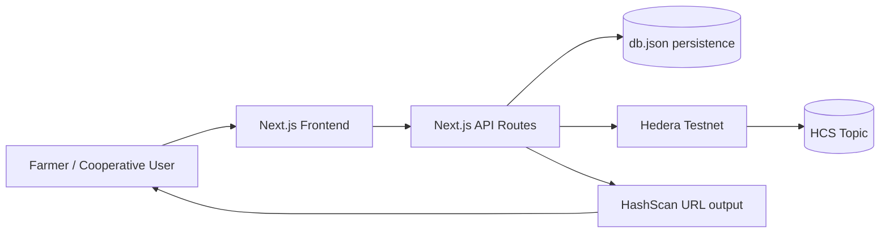
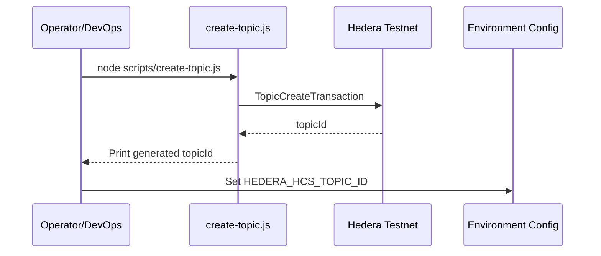
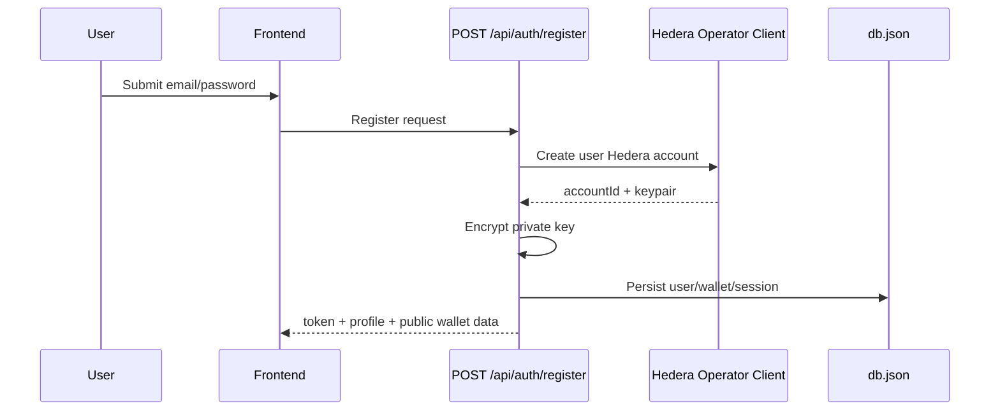
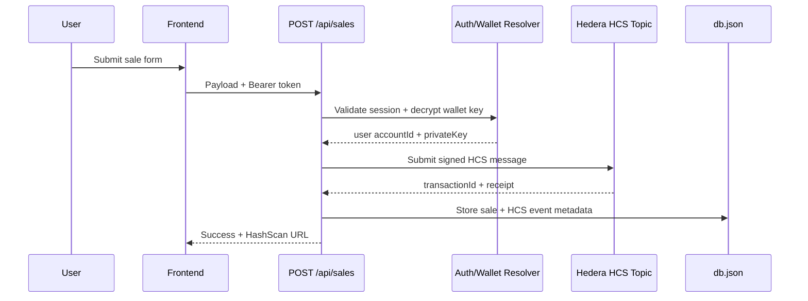
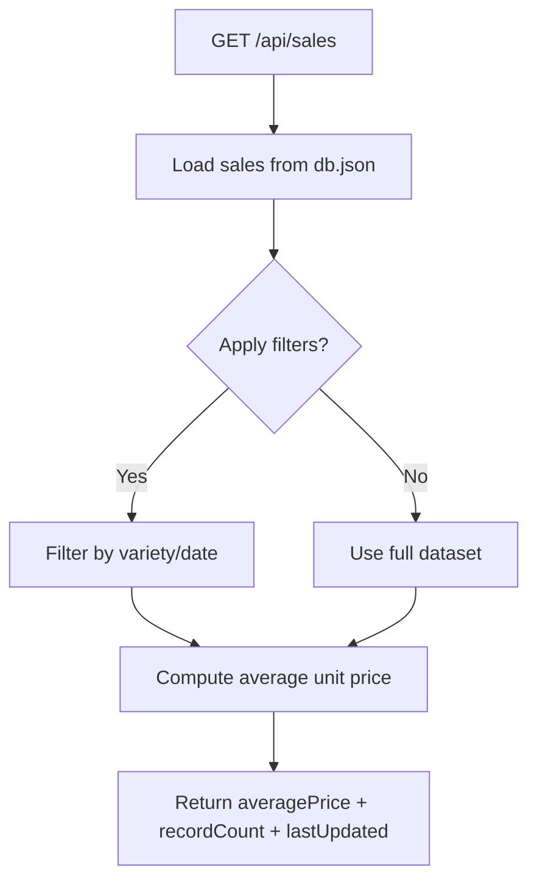
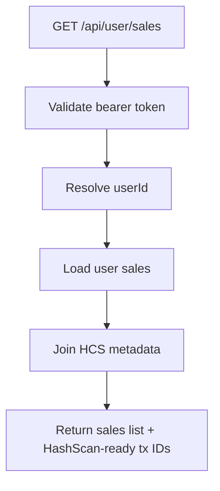

# Architecture — ChacraChain

## 1) Why this architecture

ChacraChain is a **Web2.5 custodial architecture** designed for fast adoption in agriculture:

- Users authenticate with familiar credentials.
- The backend manages blockchain complexity.
- Every sale becomes an immutable Hedera HCS message.

This gives a practical balance of UX simplicity, on-chain verifiability, and low transaction cost.

---

## 2) System boundaries

### Frontend (Next.js App Router)
- Public routes: `/`, `/login`, `/register`
- Authenticated routes: `/dashboard`, `/register-sale`, `/check-price`, `/my-sales`

### Backend (Next.js Route Handlers)
- `POST /api/auth/register`
- `POST /api/auth/login`
- `POST /api/sales`
- `GET /api/sales`
- `GET /api/user/sales`

### Persistence
- Local JSON file (`db.json`) through `src/lib/db.ts`
- Chosen for MVP speed and transparent inspection during demo

### Hedera
- Hedera Testnet
- Hedera Consensus Service (HCS) topic for immutable sale messages

### System diagram

---

## 3) Hedera account model and signing strategy

ChacraChain uses **two account roles**:

1. **Platform Operator Account** (`HEDERA_ACCOUNT_ID` + `HEDERA_PRIVATE_KEY`)
   - Used by backend infrastructure.
   - Creates user Hedera accounts on registration.
   - Funds each new user account with initial testnet HBAR (`setInitialBalance(new Hbar(5))`).

2. **Per-user Hedera Account** (created at registration)
   - A new ED25519 keypair is generated per user.
   - Private key is encrypted and stored server-side.
   - This **same user account** signs that user’s sales submissions to HCS.

### Why this is important
- Every registered sale is attributable to a unique Hedera account identity.
- The platform removes wallet friction while preserving cryptographic provenance.

---

## 4) Topic lifecycle (setup-first requirement)

Before the app can submit sales, an HCS topic must exist.

### Bootstrap process
1. Configure operator credentials in `.env.local`.
2. Execute the topic bootstrap script:
   - `node scripts/create-topic.js`
3. Script creates a new topic on testnet.
4. Copy returned Topic ID into:
   - `HEDERA_HCS_TOPIC_ID`

Without this step, sale submission fails because there is no destination topic.

### Topic bootstrap diagram

---

## 5) End-to-end runtime flows

### A) User registration flow
1. User sends email/password to `POST /api/auth/register`.
2. Backend validates uniqueness and password policy.
3. Backend creates a new Hedera account via operator credentials.
4. Backend encrypts user private key with `APP_ENCRYPTION_KEY`.
5. Backend stores user, wallet, and session in `db.json`.
6. Frontend receives session token + public wallet metadata.

### B) Register sale flow
1. User submits sale form at `/register-sale`.
2. Frontend sends payload with bearer token to `POST /api/sales`.
3. Backend validates session and resolves wallet credentials.
4. Backend decrypts user private key and signs HCS message as that user.
5. Backend stores:
   - sale record
   - HCS event metadata (`transactionId`, topic, timestamp surrogate)
6. Frontend shows success and HashScan link.

### C) Price oracle flow
1. Frontend requests `GET /api/sales` with optional filters.
2. Backend filters persisted sales by variety/date.
3. Backend computes arithmetic average (`precioUnitarioPen`).
4. Frontend renders average, count, and update context.

### D) My sales flow
1. Frontend calls `GET /api/user/sales`.
2. Backend returns user-scoped sales + linked HCS metadata.
3. Frontend renders auditable history with explorer links.

---

## 6) Security model

- No blockchain secret is exposed to client-side runtime.
- `NEXT_PUBLIC_*` is intentionally not used for sensitive values.
- Wallet private keys are encrypted at rest (`AES-256-GCM` pattern in `auth.ts`).
- Session token + expiry validation protects authenticated endpoints.

---

## 7) Hackathon benefits summary

1. **Immediate trust signals**: every sale is anchored to HCS.
2. **Low UX friction**: no wallet extension onboarding.
3. **Clear audit trail**: HashScan verifiability.
4. **Low infra complexity**: single app runtime, simple persistence.
5. **Upgrade path**: replace `db.json` with SQL/KV without changing product flows.
6. **Budget predictability**: Hedera fees are USD-denominated and paid in HBAR; with a stable sale payload schema, HCS submission costs are easier to forecast for institutions.
